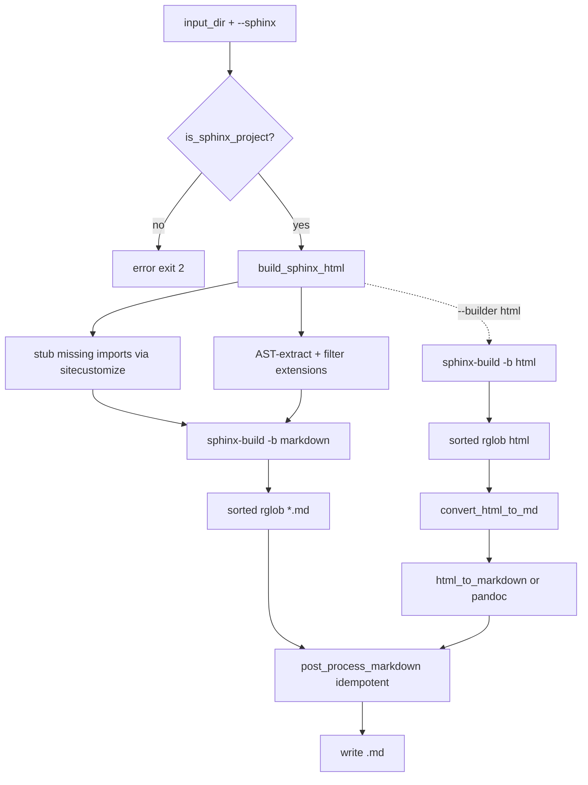

<div id="readme-top"></div>
<div align="center">

# ≡ RST to Markdown Converter ≡

A command-line tool to convert reStructuredText (`.rst`) files and full Sphinx documentation projects to clean Markdown (`.md`) — without installing the documented package or heavy Sphinx extensions.

[![Python][python-shield]][python-url]
[![Version][version-shield]][version-url]
[![License: MIT][license-shield]][license-url]
[![Code style: ruff][ruff-shield]][ruff-url]
</div>

<p align="center">╌╌╌╌╌╌╌ ❖ ╌╌╌╌╌╌╌╌</p>

## ❯ Table of Contents

1. [About](#about)
2. [Features](#features)
3. [Getting Started](#getting-started)
   - [Prerequisites](#prerequisites)
   - [Installation](#installation)
4. [Usage](#usage)
5. [Options](#options)
6. [How It Works](#how-it-works)
   - [Simple Mode](#simple-mode)
   - [Sphinx Mode](#sphinx-mode)
7. [Project Structure](#project-structure)
8. [Development](#development)
9. [Contributing](#contributing)
10. [License](#license)

<p align="center">╌╌╌╌╌╌╌ ❖ ╌╌╌╌╌╌╌╌</p>

## ❯ About

Sphinx documentation is everywhere, but Markdown is what modern tooling
consumes — LLMs, READMEs, static sites, and docs mirrors. Converting a Sphinx
project by hand means fighting theme chrome, broken cross-references, and
autodoc output that pandoc mangles.

`rst-to-md` converts entire RST trees or full Sphinx projects straight to
Markdown. In Sphinx mode it builds the doctree with a **vendored, patched**
`sphinx-markdown-builder`, stubs any missing imports, and strips theme
navigation — so you get the documentation body only, with autodoc signatures,
field lists, and `.md` cross-references intact.

<p align="right"><a href="#readme-top">⟔ ▲ ⟓</a></p>

<p align="center">╌╌╌╌╌╌╌ ❖ ╌╌╌╌╌╌╌╌</p>

## ❯ Features

- ▸ **Dual conversion modes** — simple RST files (pypandoc) or full Sphinx
  projects.
- ▸ **Lightweight Sphinx mode** — no need to install the documented package or
  heavy extensions (plot/gallery/ipython); missing imports are stubbed and
  autodoc imports are mocked automatically.
- ▸ **Pure Markdown output** — Sphinx projects render directly to Markdown via
  the vendored builder (no HTML round-trip). Autodoc blocks render field lists
  as bold labels and member signatures as bold paragraphs, matching the legacy
  `html` builder. Use `--builder html` for the legacy `rst → HTML → Markdown`
  pipeline.
- ▸ **Fast, parallel builds** — the Sphinx build runs on all CPU cores by
  default (`--build-workers`), and post-build conversion parallelizes via
  `--workers N`. A live progress line shows `N/total | elapsed | ok/err/skip`.
- ▸ **Incremental caching** — a `.md` is skipped when its source is not newer
  than the existing output (`--no-cache` to force a full reconvert).
- ▸ **CI-friendly reporting** — `--report report.json` writes a
  machine-readable summary with per-file status/errors; `--dry-run` previews
  the planned work.
- ▸ **Resilient to third-party quirks** — a `sitecustomize.py` makes Sphinx's
  `napoleon` extension exception-safe, and a mock-all fallback (`IMP-001`)
  still produces output if an extension crashes the build.
- ▸ **Clean output by default** — theme chrome (sidebar TOC, footer,
  permalinks, front matter) is stripped; `--keep-chrome` preserves it.
- ▸ **Recursive directory conversion** with preserved structure, deterministic
  sorted processing, and idempotent post-processing.
- ▸ **Multiple formats** for simple mode (`gfm`, `markdown`,
  `markdown_strict`) with configurable wrapping.

> [!NOTE]
> `html-to-markdown` is a pure-Python package, and a pandoc fallback is
> available for very large projects. Conversion speed depends on the size of
> the generated HTML, not a Rust core.

<p align="right"><a href="#readme-top">⟔ ▲ ⟓</a></p>

<p align="center">╌╌╌╌╌╌╌ ❖ ╌╌╌╌╌╌╌╌</p>

## ❯ Getting Started

### ⌬ Prerequisites

- **Python 3.10+** — the tool targets `py310` and newer.
- **pandoc** — bundled via the `pypandoc-binary` dependency (simple mode).
- **Sphinx** — installed as a runtime dependency (Sphinx mode).

The `sphinx-markdown-builder` extension is **vendored** inside the package
(`rst_to_md/_vendor/`), so it is not a separate install.

<p align="center">◇ ◇ ◇ ◇ ◇</p>

### ⌬ Installation

```bash
# Using uv (recommended)
uv sync

# Or pip
pip install -e ".[dev]"   # includes dev tools (pytest, ruff, mypy)
pip install -e .          # runtime only
```

Runtime dependencies: `pypandoc` (+ `pypandoc-binary`), `sphinx`,
`html-to-markdown`, and `beautifulsoup4`.

<p align="right"><a href="#readme-top">⟔ ▲ ⟓</a></p>

<p align="center">╌╌╌╌╌╌╌ ❖ ╌╌╌╌╌╌╌╌</p>

## ❯ Usage

```bash
# Simple RST directory
rst-to-md docs
rst-to-md docs output

# Sphinx project (lightweight, no project deps required)
rst-to-md ./librosa/docs ./out_docs --sphinx

# Full sphinx build with all features
rst-to-md ./librosa/docs ./out_docs --sphinx --no-lightweight

# Run as a module
python -m rst_to_md docs md_docs --verbose
```

> [!TIP]
> In Sphinx mode the output is stripped of theme-generated navigation chrome —
> YAML front matter, sidebar TOC, theme icons/logo, "Back to top"/"View this
> page" links, footer navigation, copyright line, "On this page" TOC, and `¶`
> heading permalinks. Pass `--keep-chrome` to preserve all of it.

<p align="right"><a href="#readme-top">⟔ ▲ ⟓</a></p>

<p align="center">╌╌╌╌╌╌╌ ❖ ╌╌╌╌╌╌╌╌</p>

## ❯ Options

```text
usage: rst-to-md [-h] [-w {none,auto,preserve}]
                 [-f {gfm,markdown,markdown_strict}] [-v] [--version]
                 [--sphinx] [--sphinx-opts [SPHINX_OPTS ...]] [--no-clean]
                 [--lightweight] [--no-lightweight] [--keep-chrome]
                 [--no-cache] [--workers WORKERS] [--report REPORT]
                 [--dry-run] [-b BUILDER] [--no-progress]
                 [--build-workers BUILD_WORKERS]
                 [--autosummary-generate {auto,true,false}]
                 input_dir [output_dir]
```

| Option | Description |
| ------ | ----------- |
| `input_dir` | Directory with `.rst` files (or a Sphinx project containing `conf.py`) |
| `output_dir` | Output directory (default: `<input_dir>_md`) |
| `-w, --wrap` | Pandoc wrap option: `none`, `auto`, `preserve` (simple mode) |
| `-f, --format` | Output format for **simple mode**: `gfm`, `markdown`, `markdown_strict` |
| `-v, --verbose` | Verbose logging |
| `--sphinx` | Sphinx-aware conversion |
| `--sphinx-opts` | Extra options forwarded to `sphinx-build` |
| `-b, --builder` | Sphinx builder (default `markdown`; `html` = legacy `rst → HTML → Markdown`) |
| `--build-workers N` | Parallel Sphinx build workers: `0` = auto (CPU count), `1` = serial (default `0`) |
| `--autosummary-generate` | `auto` (default): only if importable; `true`: always; `false`: stub + enrich from source |
| `--workers N` | Parallel post-build conversion workers (default `1`, serial) |
| `--no-clean` | Keep the Sphinx build directory |
| `--lightweight` / `--no-lightweight` | Toggle lightweight mode (default ON) |
| `--keep-chrome` | Keep Sphinx/theme navigation chrome (stripped by default) |
| `--no-cache` | Disable incremental caching (reconvert every file) |
| `--report PATH` | Write a JSON summary (counts + per-file errors) to `PATH` |
| `--dry-run` | List the planned `src -> dst` work and convert nothing |
| `--no-progress` | Disable the live progress line |

> [!NOTE]
> In Sphinx mode the HTML→Markdown step uses `html-to-markdown`, which does
> not expose format/wrap knobs; `--format` and `--wrap` only affect simple
> (pypandoc) mode.

<p align="right"><a href="#readme-top">⟔ ▲ ⟓</a></p>

<p align="center">╌╌╌╌╌╌╌ ❖ ╌╌╌╌╌╌╌╌</p>

## ❯ How It Works

### ⌬ Simple Mode

1. Recursively find all `.rst` files (in sorted order).
2. Convert each with pypandoc.
3. Post-process: normalize line endings, collapse blank lines, rewrite links.

<p align="center">◇ ◇ ◇ ◇ ◇</p>

### ⌬ Sphinx Mode



The default builder is `markdown` (`sphinx-markdown-builder`), which renders
the doctree straight to Markdown — no HTML round-trip, so there is no chrome
to strip and no HTML-specific post-processing, only the shared deterministic
cleanup. Pass `--builder html` to use the legacy `rst → HTML → Markdown`
pipeline (needed when a project's extensions are incompatible with the
Markdown builder). Both builders share the same `(success, errors, skipped)`
contract and the same skip/cache/parallel/report features.

In lightweight mode the tool:

- ▸ injects a `sitecustomize.py` (via `PYTHONPATH`) that stubs any top-level
  module imported by `conf.py` but not installed;
- ▸ sets `autodoc_mock_imports` to those same modules so `automodule` renders
  without the real package;
- ▸ disables plot/gallery/ipython extensions and overrides `extensions` with a
  safe, filtered set;
- ▸ makes Sphinx's `napoleon` extension exception-safe, so members that raise
  on attribute access (e.g. some pydantic models) are skipped instead of
  crashing the build.

> [!IMPORTANT]
> **Autodoc content is preserved.** The documentation body is extracted from
> the page's content container (`<main>` / `<article>`) *before* conversion,
> so `autoclass` / `autofunction` output is kept intact — class signatures,
> the `Bases:` inheritance list, members (`:members:`, `:special-members:`,
> `:undoc-members:`), and the `Parameters:` / `Raises:` / `Returns:` field
> lists. Signature parameters are emitted as code spans (e.g. `` `**kwargs` ``)
> rather than being mangled by Markdown emphasis. Cross-reference links (base
> classes, methods) are rewritten from `.html` to `.md`.

There is one trade-off to be aware of when relying on mocked imports:

> [!WARNING]
> **Inheritance requires the documented package.** In lightweight mode a
> missing package is mocked so the build can succeed, but a *mocked* package
> has no real class hierarchy, so `:show-inheritance:` yields an empty
> `Bases:` line. To keep the inheritance list, install the package you are
> documenting (e.g. `pip install aiogram`) — the converter never mocks a
> package that is actually importable, so autodoc then resolves the real
> `Bases:` and member signatures.

<p align="right"><a href="#readme-top">⟔ ▲ ⟓</a></p>

<p align="center">╌╌╌╌╌╌╌ ❖ ╌╌╌╌╌╌╌╌</p>

## ❯ Project Structure

```text
rst-to-md/
├── rst_to_md/
│   ├── __init__.py          # Public API + version (single source of truth)
│   ├── __main__.py          # `python -m rst_to_md` entry point
│   ├── cli.py               # Argument parsing + dispatch
│   ├── config.py            # Conversion policy constants
│   ├── exceptions.py        # Custom exceptions
│   ├── py.typed             # PEP 561 marker
│   ├── _templates/
│   │   └── sitecustomize.py.tmpl  # Import-stub template for lightweight builds
│   ├── _vendor/
│   │   └── sphinx_markdown_builder/  # Vendored Markdown builder (patched)
│   ├── core/
│   │   ├── autosummary_enrich.py  # Autosummary table enrichment + stubs
│   │   ├── cache.py         # Incremental mtime-based skip
│   │   ├── html_clean.py    # HTML artifact cleanup
│   │   ├── logging.py       # Logging setup
│   │   ├── postprocess.py   # Pure Markdown cleanup (idempotent)
│   │   ├── progress.py      # Live TTY progress line
│   │   └── source_extract.py  # AST-based source/docstring extraction
│   └── converters/
│       ├── rst.py           # Simple RST -> MD (pypandoc)
│       └── sphinx.py        # Sphinx build + HTML/MD -> MD
├── tests/                   # Unit + integration tests and fixtures
├── docs/plans/              # Implementation plans
├── pyproject.toml
├── README.md
├── LICENSE
└── CHANGELOG.md
```

<p align="right"><a href="#readme-top">⟔ ▲ ⟓</a></p>

<p align="center">╌╌╌╌╌╌╌ ❖ ╌╌╌╌╌╌╌╌</p>

## ❯ Development

```bash
make lint      # ruff
make type      # mypy
make test      # pytest with coverage
```

<p align="right"><a href="#readme-top">⟔ ▲ ⟓</a></p>

<!-- ===================== BADGE DEFINITIONS (reference-style) ===================== -->

[python-shield]: https://img.shields.io/badge/python-3.10%2B-3670A0?style=for-the-badge&logo=python&logoColor=ffdd54
[python-url]: https://www.python.org/
[version-shield]: https://img.shields.io/badge/version-1.4.3-informational?style=for-the-badge
[version-url]: CHANGELOG.md
[ci-shield]: https://img.shields.io/github/actions/workflow/status/wildminder/rst-to-md/ci.yml?style=for-the-badge
[ci-url]: https://github.com/wildminder/rst-to-md/actions/workflows/ci.yml
[license-shield]: https://img.shields.io/badge/License-MIT-yellow?style=for-the-badge
[license-url]: LICENSE
[ruff-shield]: https://img.shields.io/badge/code%20style-ruff-000000?style=for-the-badge
[ruff-url]: https://github.com/astral-sh/ruff
