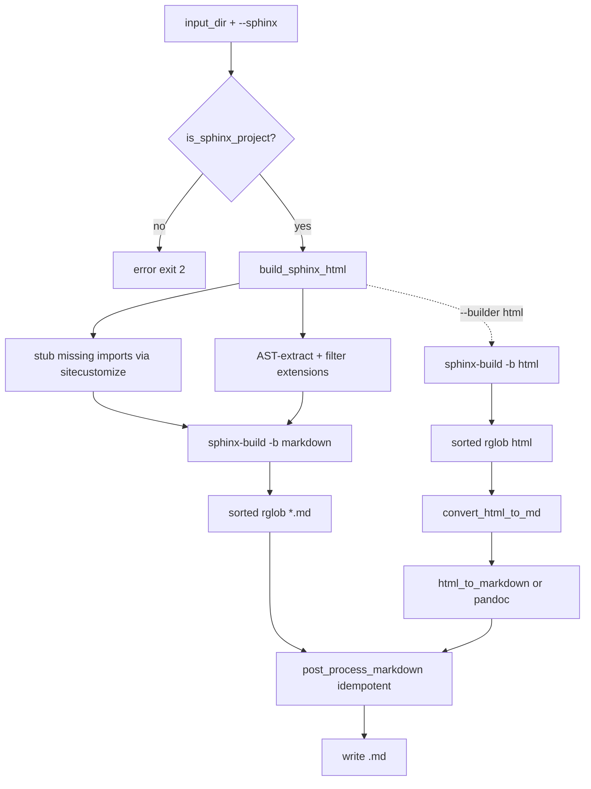

<div id="readme-top"></div>
<div align="center">

# ≡ RST to Markdown Converter ≡

CLI tool to convert reStructuredText (`.rst`) files and Sphinx documentation projects to Markdown (`.md`) without installing project dependencies or heavy extensions.

[![Python][python-shield]][python-url]
[![Version][version-shield]][version-url]
[![License: MIT][license-shield]][license-url]
[![Code style: ruff][ruff-shield]][ruff-url]
</div>

<p align="center">╌╌╌╌╌╌╌ ❖ ╌╌╌╌╌╌╌╌</p>

## ❯ Table of Contents

1. [About](#about)
2. [Features](#features)
3. [Getting Started](#getting-started)
   - [Prerequisites](#prerequisites)
   - [Installation](#installation)
4. [Usage](#usage)
5. [Options](#options)
6. [How It Works](#how-it-works)
   - [Simple Mode](#simple-mode)
   - [Sphinx Mode](#sphinx-mode)
7. [Project Structure](#project-structure)
8. [Development](#development)
9. [Contributing](#contributing)
10. [License](#license)

<p align="center">╌╌╌╌╌╌╌ ❖ ╌╌╌╌╌╌╌╌</p>

## ❯ About

`rst-to-md` converts RST source trees and full Sphinx documentation projects directly to Markdown. In Sphinx mode, it builds the doctree via a vendored `sphinx-markdown-builder`, stubs missing imports, and removes navigation chrome while keeping autodoc signatures, field lists, and cross-references intact.

<p align="right"><a href="#readme-top">⟔ ▲ ⟓</a></p>

<p align="center">╌╌╌╌╌╌╌ ❖ ╌╌╌╌╌╌╌╌</p>

## ❯ Features

- ▸ **Dual conversion modes** — simple RST files via `pypandoc` or full Sphinx projects.
- ▸ **Lightweight Sphinx mode** — stubs missing imports and mocks autodoc dependencies automatically; no target package installation required.
- ▸ **Direct Markdown output** — renders via vendored `sphinx-markdown-builder` without HTML intermediate steps. Supports `--builder html` for legacy pipeline.
- ▸ **Parallel builds** — multi-core Sphinx builds (`--build-workers`) and post-processing (`--workers`).
- ▸ **Incremental caching** — skips unchanged target files (`--no-cache` to force rebuild).
- ▸ **CI reporting** — machine-readable JSON summary (`--report`) and execution preview (`--dry-run`).
- ▸ **Fault tolerant** — exception-safe handling for third-party extensions (e.g., `napoleon`) with automatic mock fallbacks.
- ▸ **Clean output** — strips theme navigation, sidebars, footers, and permalinks by default (`--keep-chrome` to preserve).
- ▸ **Directory structure preservation** — recursive processing with deterministic output.
- ▸ **Multiple formats** — supports `gfm`, `markdown`, and `markdown_strict` for simple mode.

> [!NOTE]
> HTML-to-Markdown conversion uses `html-to-markdown` in pure Python, with optional `pandoc` fallback.

<p align="right"><a href="#readme-top">⟔ ▲ ⟓</a></p>

<p align="center">╌╌╌╌╌╌╌ ❖ ╌╌╌╌╌╌╌╌</p>

## ❯ Getting Started

### ⌬ Prerequisites

- **Python 3.10+**
- **pandoc** (provided by `pypandoc-binary` dependency)
- **Sphinx** (runtime dependency; `sphinx-markdown-builder` is vendored)

<p align="center">◇ ◇ ◇ ◇ ◇</p>

### ⌬ Installation

```bash
# Using uv
uv sync

# Using pip
pip install -e ".[dev]"   # Includes dev tools
pip install -e .          # Runtime only
```

Runtime dependencies: `pypandoc`, `pypandoc-binary`, `sphinx`, `html-to-markdown`, `beautifulsoup4`.

<p align="right"><a href="#readme-top">⟔ ▲ ⟓</a></p>

<p align="center">╌╌╌╌╌╌╌ ❖ ╌╌╌╌╌╌╌╌</p>

## ❯ Usage

```bash
# Convert simple RST directory
rst-to-md docs output

# Convert Sphinx project (lightweight mode)
rst-to-md ./librosa/docs ./out_docs --sphinx

# Convert Sphinx project (full dependency mode)
rst-to-md ./librosa/docs ./out_docs --sphinx --no-lightweight

# Run as Python module
python -m rst_to_md docs md_docs --verbose
```

> [!TIP]
> Sphinx mode strips theme navigation chrome by default. Use `--keep-chrome` to retain sidebars, footers, and TOCs.

<p align="right"><a href="#readme-top">⟔ ▲ ⟓</a></p>

<p align="center">╌╌╌╌╌╌╌ ❖ ╌╌╌╌╌╌╌╌</p>

## ❯ Options

```text
usage: rst-to-md [-h] [-w {none,auto,preserve}]
                 [-f {gfm,markdown,markdown_strict}] [-v] [--version]
                 [--sphinx] [--sphinx-opts [SPHINX_OPTS ...]] [--no-clean]
                 [--lightweight] [--no-lightweight] [--keep-chrome]
                 [--no-cache] [--workers WORKERS] [--report REPORT]
                 [--dry-run] [-b BUILDER] [--no-progress]
                 [--build-workers BUILD_WORKERS]
                 [--autosummary-generate {auto,true,false}]
                 input_dir [output_dir]
```

| Option | Description |
| ------ | ----------- |
| `input_dir` | Directory containing `.rst` files or a Sphinx `conf.py` |
| `output_dir` | Destination directory (default: `<input_dir>_md`) |
| `-w, --wrap` | Text wrapping: `none`, `auto`, `preserve` (simple mode only) |
| `-f, --format` | Output format: `gfm`, `markdown`, `markdown_strict` (simple mode only) |
| `-v, --verbose` | Enable verbose logging |
| `--sphinx` | Enable Sphinx documentation processing |
| `--sphinx-opts` | Additional options passed to `sphinx-build` |
| `-b, --builder` | Sphinx builder: `markdown` (default) or `html` |
| `--build-workers N` | Parallel Sphinx workers: `0` (auto/CPUs), `1` (serial) |
| `--autosummary-generate` | Autosummary generation: `auto` (default), `true`, `false` |
| `--workers N` | Parallel post-processing workers (default: `1`) |
| `--no-clean` | Retain temporary Sphinx build directory |
| `--lightweight` / `--no-lightweight` | Toggle dependency stubbing (default: enabled) |
| `--keep-chrome` | Retain navigation and theme chrome in output |
| `--no-cache` | Force re-conversion of all files |
| `--report PATH` | Export JSON summary report to `PATH` |
| `--dry-run` | Show planned conversions without executing |
| `--no-progress` | Disable progress bar |

> [!NOTE]
> Options `--format` and `--wrap` apply only to simple mode (`pypandoc`).

<p align="right"><a href="#readme-top">⟔ ▲ ⟓</a></p>

<p align="center">╌╌╌╌╌╌╌ ❖ ╌╌╌╌╌╌╌╌</p>

## ❯ How It Works

### ⌬ Simple Mode

1. Scans recursively for `.rst` files.
2. Converts each file via `pypandoc`.
3. Normalizes line endings, cleans extra line breaks, and rewrites relative links.

<p align="center">◇ ◇ ◇ ◇ ◇</p>

### ⌬ Sphinx Mode



The `markdown` builder directly transforms the Sphinx doctree to Markdown. The `--builder html` option invokes the legacy `RST → HTML → Markdown` pipeline.

In lightweight mode:
- Injects `sitecustomize.py` to stub uninstalled Python modules imported in `conf.py`.
- Configures `autodoc_mock_imports` automatically.
- Filters out non-essential extensions (e.g., plot, gallery, ipython).
- Wraps `napoleon` routines to handle attribute errors safely.

> [!IMPORTANT]
> **Autodoc content is preserved.** Signatures, inheritance listings, field lists (`Parameters`, `Returns`), and member docstrings are retained. Signature parameters are formatted as inline code blocks, and `.html` links are rewritten to `.md`.

> [!WARNING]
> **Inheritance tracking requires target package installation.** Mocked modules do not provide runtime class hierarchies, resulting in empty `Bases:` fields under `:show-inheritance:`. Install the documented package locally to render complete inheritance chains.

<p align="right"><a href="#readme-top">⟔ ▲ ⟓</a></p>

<p align="center">╌╌╌╌╌╌╌ ❖ ╌╌╌╌╌╌╌╌</p>

## ❯ Project Structure

```text
rst-to-md/
├── rst_to_md/
│   ├── __init__.py          # Public API and package version
│   ├── __main__.py          # Module entry point (`python -m rst_to_md`)
│   ├── cli.py               # Argument parsing and execution control
│   ├── config.py            # Global constants and defaults
│   ├── exceptions.py        # Exception types
│   ├── py.typed             # PEP 561 type marker
│   ├── _templates/
│   │   └── sitecustomize.py.tmpl  # Import stubbing template
│   ├── _vendor/
│   │   └── sphinx_markdown_builder/  # Patched Markdown builder
│   ├── core/
│   │   ├── autosummary_enrich.py  # Autosummary processing
│   │   ├── cache.py         # File modification caching
│   │   ├── html_clean.py    # HTML artifact stripping
│   │   ├── logging.py       # Logging configuration
│   │   ├── postprocess.py   # Markdown normalization
│   │   ├── progress.py      # Console progress tracking
│   │   └── source_extract.py  # AST extraction tools
│   └── converters/
│       ├── rst.py           # Pypandoc conversion logic
│       └── sphinx.py        # Sphinx build execution
├── tests/                   # Suite of unit and integration tests
├── docs/plans/              # Design specifications
├── pyproject.toml
├── README.md
├── LICENSE
└── CHANGELOG.md
```

<p align="right"><a href="#readme-top">⟔ ▲ ⟓</a></p>

<p align="center">╌╌╌╌╌╌╌ ❖ ╌╌╌╌╌╌╌╌</p>

## ❯ Development

```bash
make lint      # Run ruff checks
make type      # Run mypy type checking
make test      # Run pytest with coverage
```

<p align="right"><a href="#readme-top">⟔ ▲ ⟓</a></p>

<!-- ===================== BADGE DEFINITIONS (reference-style) ===================== -->

[python-shield]: https://img.shields.io/badge/python-3.10%2B-3670A0?style=for-the-badge&logo=python&logoColor=ffdd54
[python-url]: https://www.python.org/
[version-shield]: https://img.shields.io/badge/version-1.4.3-informational?style=for-the-badge
[version-url]: CHANGELOG.md
[ci-shield]: https://img.shields.io/github/actions/workflow/status/wildminder/rst-to-md/ci.yml?style=for-the-badge
[ci-url]: https://github.com/wildminder/rst-to-md/actions/workflows/ci.yml
[license-shield]: https://img.shields.io/badge/License-MIT-yellow?style=for-the-badge
[license-url]: LICENSE
[ruff-shield]: https://img.shields.io/badge/code%20style-ruff-000000?style=for-the-badge
[ruff-url]: https://github.com/astral-sh/ruff