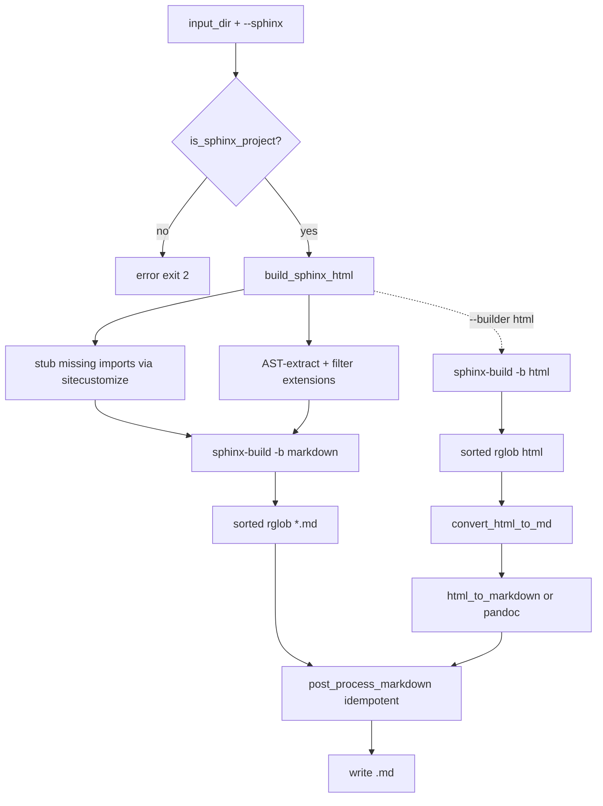

# RST to Markdown Converter

[](https://github.com/wildminder/rst-to-md/actions/workflows/ci.yml)
[](LICENSE)
[](https://www.python.org/)

A command-line tool to convert reStructuredText (`.rst`) files and full Sphinx
documentation projects to clean Markdown (`.md`).

## Features

- ✅ **Dual conversion modes**: simple RST files OR full Sphinx projects
- ✅ **Lightweight Sphinx mode**: no need to install the documented package or
  heavy extensions (plot/gallery/ipython) — missing imports are stubbed and
  autodoc imports are mocked automatically
- ✅ **Pure markdown output**: Sphinx projects are rendered directly to Markdown
  via a **vendored, patched** `sphinx-markdown-builder` (no HTML round-trip);
  simple RST files use `html-to-markdown` (with a pandoc fallback). Both paths
  are post-processed to remove navigation, footers, and broken media links. The
  vendored builder's `MarkdownTranslator` is patched so autodoc blocks
  (`autoclass`/`automethod`) render field lists as bold labels, `property`/`class`
  annotations as plain text, and member signatures as bold paragraphs — matching
  the legacy `html` builder. Use `--builder html` to fall back to the legacy
  `rst → HTML → Markdown` pipeline.
- ✅ **Fast, parallel builds**: the Sphinx build runs on all CPU cores by default
  (`-j N`, see `--build-workers`); post-build conversion is parallelized via
  `--workers N`. A live progress line shows `N/total | elapsed | ok/err/skip | rate`.
- ✅ **Incremental caching**: a `.md` is skipped when its source is not newer than
  the existing output (`--no-cache` to force a full reconvert).
- ✅ **CI-friendly reporting**: `--report report.json` writes a machine-readable
  summary with per-file status/errors; `--dry-run` previews the planned work.
- ✅ **Resilient to third-party quirks**: a `sitecustomize.py` makes Sphinx's
  `napoleon` extension exception-safe, and a mock-all fallback (`IMP-001`) still
  produces output if an extension crashes the build.
- ✅ **Recursive directory conversion** with preserved structure
- ✅ **Deterministic output**: files are processed in sorted order and the
  post-processing pipeline is idempotent
- ✅ **Multiple formats** for simple mode: GFM, standard markdown, strict markdown
- ✅ **Configurable wrapping options**

> **Note on performance:** `html-to-markdown` is a pure-Python package. For very
> large projects the pandoc fallback is also available. The conversion speed
> therefore depends on the size of the generated HTML, not a Rust core.

## Installation

```bash
# Using uv (recommended)
uv sync

# Or pip
pip install -e ".[dev]"   # includes dev tools (pytest, ruff, mypy)
pip install -e .          # runtime only
```

Runtime dependencies: `pypandoc` (+ `pypandoc-binary`), `sphinx`, and
`html-to-markdown`. The `sphinx-markdown-builder` extension is **vendored**
inside the package (`rst_to_md/_vendor/`), so it is not a separate install.

## Usage

```bash
# Simple RST directory
rst-to-md docs
rst-to-md docs output

# Sphinx project (lightweight, no project deps required)
rst-to-md ./librosa/docs ./out_docs --sphinx

# Full sphinx build with all features
rst-to-md ./librosa/docs ./out_docs --sphinx --no-lightweight

# Run as a module
python -m rst_to_md docs md_docs --verbose
```

### Options

```
usage: rst-to-md [-h] [-w {none,auto,preserve}] [-f {gfm,markdown,markdown_strict}]
                [-v] [--version] [--sphinx] [--sphinx-opts ...] [--no-clean]
                [--lightweight] [--no-lightweight] [--keep-chrome]
                input_dir [output_dir]
```

| Option | Description |
|--------|-------------|
| `input_dir` | Directory with `.rst` files (or a Sphinx project containing `conf.py`) |
| `output_dir` | Output directory (default: `<input_dir>_md`) |
| `-w/--wrap` | Pandoc wrap option: `none`, `auto`, `preserve` (simple mode) |
| `-f/--format` | Output format for **simple mode**: `gfm`, `markdown`, `markdown_strict` |
| `-v/--verbose` | Verbose logging |
| `--sphinx` | Sphinx-aware conversion |
| `--sphinx-opts` | Extra options forwarded to `sphinx-build` |
| `--builder NAME` | Sphinx builder to use (default `markdown`; `html` = legacy `rst → HTML → Markdown`) |
| `--build-workers N` | Parallel Sphinx build workers: `0` = auto (CPU count), `1` = serial (default `0`) |
| `--autosummary-generate {auto,true,false}` | Autosummary stub-page generation (default `auto`): `auto` generates real tables only when the documented package is importable, `true` always (may crash if the package is missing), `false` always stubs and enriches the table from the package source tree (no import required). |
| `--workers N` | Parallel post-build conversion workers (default `1`, serial) |
| `--no-clean` | Keep the Sphinx build directory |
| `--lightweight` / `--no-lightweight` | Toggle lightweight mode (default ON) |
| `--keep-chrome` | Keep Sphinx/theme navigation chrome (sidebar TOC, footer, "On this page" TOC, heading permalinks). Default: stripped for clean Markdown. |
| `--no-cache` | Disable incremental caching (reconvert every file) |
| `--report PATH` | Write a JSON summary (counts + per-file errors) to `PATH` |
| `--dry-run` | List the planned `src -> dst` work and convert nothing |
| `--no-progress` | Disable the live progress line |

> **Sphinx mode & `--format`/`--wrap`:** In Sphinx mode the HTML→Markdown step
> uses `html-to-markdown`, which does not expose format/wrap knobs; these options
> only affect simple (pypandoc) mode.

> **Clean output by default:** In Sphinx mode the generated Markdown is stripped
> of theme-generated navigation chrome — the YAML front matter, the global
> sidebar table of contents, theme icons/logo, "Back to top"/"View this page"
> links, the footer navigation (Previous/Next), the copyright line, the local
> "On this page" table of contents, and the `¶` heading permalinks. Pass
> `--keep-chrome` to preserve all of it.

> **Autodoc content is preserved:** The documentation body is extracted from
> the page's content container (`<main>` / `<article>`) *before* conversion, so
> `autoclass` / `autofunction` output is kept intact — class signatures, the
> `Bases:` inheritance list, members (`:members:`, `:special-members:`,
> `:undoc-members:`), and the `Parameters:` / `Raises:` / `Returns:` field
> lists. Signature parameters are emitted as code spans (e.g. `` `**kwargs` ``)
> rather than being mangled by Markdown emphasis. Cross-reference links (base
> classes, methods) are rewritten from `.html` to `.md`.

> **Inheritance requires the documented package:** In lightweight mode a
> missing package is mocked so the build can succeed, but a *mocked* package
> has no real class hierarchy, so `:show-inheritance:` yields an empty
> `Bases:` line. To keep the inheritance list, install the package you are
> documenting (e.g. `pip install aiogram`) — the converter never mocks a
> package that is actually importable, so autodoc then resolves the real
> `Bases:` and member signatures.

> **Resilient to third-party quirks:** Some libraries (e.g. pydantic models)
> raise when their attributes are accessed during autodoc member gathering,
> which would otherwise abort the entire Sphinx build. The converter installs a
> small `sitecustomize.py` that makes Sphinx's `napoleon` extension
> exception-safe, so such members are skipped instead of crashing the build.

## How It Works

### Simple mode

1. Recursively find all `.rst` files (in sorted order).
2. Convert each with pypandoc.
3. Post-process: normalize line endings, collapse blank lines, rewrite links.

### Sphinx mode



The default builder is `markdown` (`sphinx-markdown-builder`), which renders the
doctree straight to Markdown — no HTML round-trip, so there is no chrome to strip
and no HTML-specific post-processing, only the shared deterministic cleanup. Pass
`--builder html` to use the legacy `rst → HTML → Markdown` pipeline (needed when a
project's extensions are incompatible with the Markdown builder). Both builders
share the same `(success, errors, skipped)` contract and the same
skip/cache/parallel/report features.

In lightweight mode the tool:

- injects a `sitecustomize.py` (via `PYTHONPATH`) that stubs any top-level
  module imported by `conf.py` but not installed;
- sets `autodoc_mock_imports` to those same modules so `automodule` renders
  without the real package;
- disables plot/gallery/ipython extensions and overrides `extensions` with a
  safe, filtered set.

## Project Structure

```
rst-to-md/
├── rst_to_md/
│   ├── __init__.py          # Public API + version
│   ├── __main__.py          # `python -m rst_to_md` entry point
│   ├── cli.py               # Argument parsing + dispatch
│   ├── config.py            # Conversion policy constants
│   ├── exceptions.py        # Custom exceptions
│   ├── py.typed             # PEP 561 marker
│   ├── core/
│   │   ├── logging.py       # Logging setup
│   │   ├── postprocess.py   # Pure Markdown cleanup (idempotent)
│   │   ├── cache.py         # Incremental mtime-based skip
│   │   └── progress.py      # Live TTY progress line
│   └── converters/
│       ├── rst.py           # Simple RST -> MD
│       └── sphinx.py        # Sphinx build + HTML/MD -> MD
├── tests/                   # Unit + integration tests and fixtures
├── docs/plans/              # Implementation plans
├── pyproject.toml
├── README.md
├── LICENSE
└── CHANGELOG.md
```

## Development

```bash
make lint      # ruff
make type      # mypy
make test      # pytest with coverage
```

## License

MIT — see [LICENSE](LICENSE).
